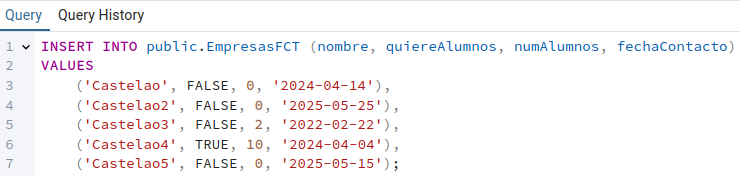
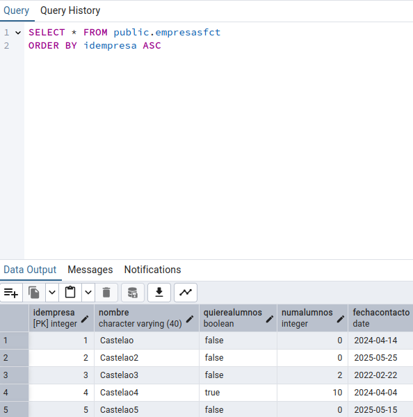
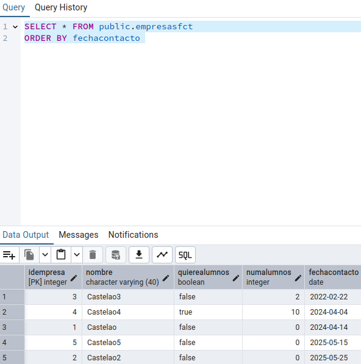
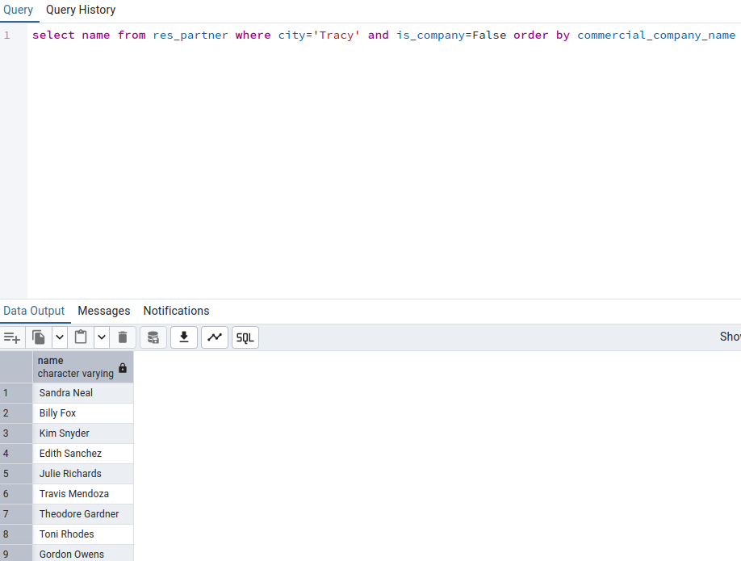

# SXE - Tarea 12 - Odoo BBDD

## `Apartado 1`

Sentencia SQL:
```
CREATE TABLE IF NOT EXISTS public.EmpresasFCT(
	idEmpresa SERIAL PRIMARY KEY,
	nombre VARCHAR(40),
	quiereAlumnos BOOLEAN,
	numAlumnos INTEGER,
	fechaContacto DATE
);
```


Ejecución:


## `Apartado 2`

Sentencia SQL:
```
INSERT INTO public.EmpresasFCT (nombre, quiereAlumnos, numAlumnos, fechaContacto)
VALUES
    ('Castelao', FALSE, 0, '2024-04-14'),
    ('Castelao2', FALSE, 0, '2025-05-25'),
    ('Castelao3', FALSE, 2, '2022-02-22'),
    ('Castelao4', TRUE, 10, '2024-04-04'),
    ('Castelao5', FALSE, 0, '2025-05-15');
```



Ejecución:



## `Apartado 3`

Sentencia SQL:
```
SELECT * FROM public.empresasfct ORDER BY fechacontacto 
```

Resultado de la ejecución:



## `Apartado 4`

Sentencia SQL:
```
select name from res_partner where city='Tracy' and is_company=False order by commercial_company_name
```

Resultado de la ejecución:

