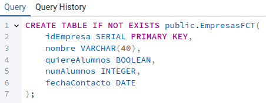
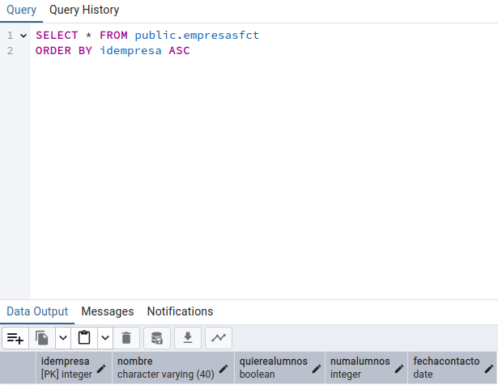

# SXE - Tarea 12 - Odoo BBDD

## `Apartado 1`

Sentencia SQL:
```
CREATE TABLE IF NOT EXISTS public.EmpresasFCT(
	idEmpresa SERIAL PRIMARY KEY,
	nombre VARCHAR(40),
	quiereAlumnos BOOLEAN,
	numAlumnos INTEGER,
	fechaContacto DATE
);
```



Ejecución:


