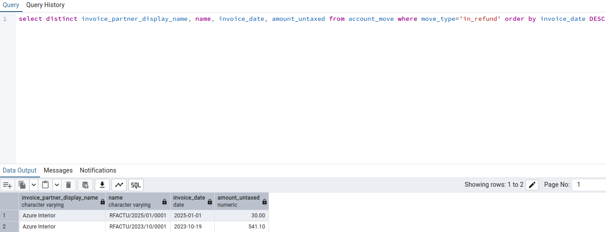
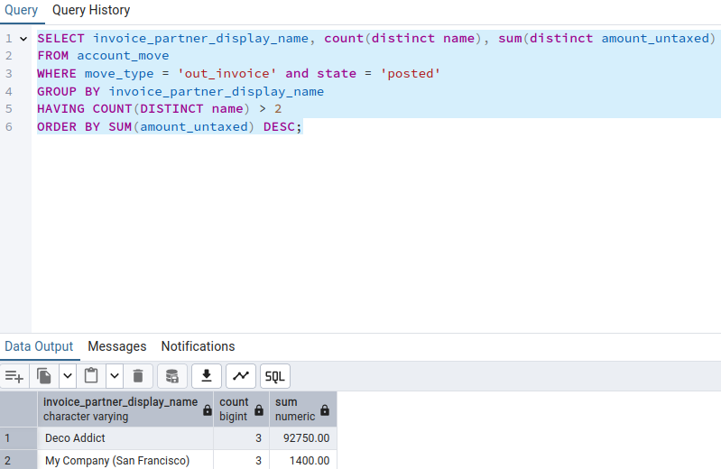
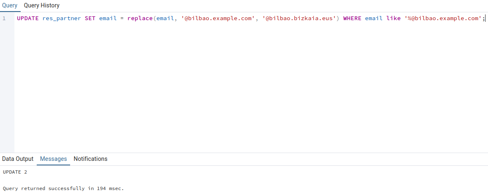
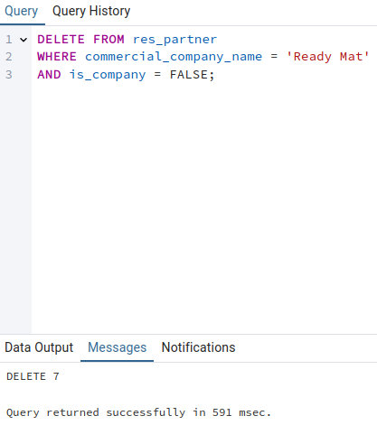

# SXE - Tarea 12 - Odoo BBDD

## `Apartado 1`

Sentencia SQL:
```
CREATE TABLE IF NOT EXISTS public.EmpresasFCT(
	idEmpresa SERIAL PRIMARY KEY,
	nombre VARCHAR(40),
	quiereAlumnos BOOLEAN,
	numAlumnos INTEGER,
	fechaContacto DATE
);
```


Ejecución:


## `Apartado 2`

Sentencia SQL:
```
INSERT INTO public.EmpresasFCT (nombre, quiereAlumnos, numAlumnos, fechaContacto)
VALUES
    ('Castelao', FALSE, 0, '2024-04-14'),
    ('Castelao2', FALSE, 0, '2025-05-25'),
    ('Castelao3', FALSE, 2, '2022-02-22'),
    ('Castelao4', TRUE, 10, '2024-04-04'),
    ('Castelao5', FALSE, 0, '2025-05-15');
```


Ejecución:


## `Apartado 3`

Sentencia SQL:
```
SELECT * FROM public.empresasfct ORDER BY fechacontacto 
```

Resultado de la ejecución:


## `Apartado 4`

Sentencia SQL:
```
select name from res_partner where city='Tracy' and is_company=False order by commercial_company_name
```

Resultado de la ejecución:


## `Apartado 5`

Sentencia SQL:
```
select distinct invoice_partner_display_name, name, invoice_date, amount_untaxed from account_move where move_type='in_refund' order by invoice_date DESC
```

Resultado de la ejecución:



## `Apartado 6`

Sentencia SQL:
```
SELECT invoice_partner_display_name, count(distinct name), sum(distinct amount_untaxed) 
FROM account_move
WHERE move_type = 'out_invoice' and state = 'posted'
GROUP BY invoice_partner_display_name
HAVING COUNT(DISTINCT name) > 2
ORDER BY SUM(amount_untaxed) DESC;
```

Resultado de la ejecución:



## `Apartado 7`

Sentencia SQL:
```
UPDATE res_partner SET email = replace(email, '@bilbao.example.com', '@bilbao.bizkaia.eus') WHERE email like '%@bilbao.example.com';
```

Ejecución de la sentencia:



## `Apartado 8`

Antes del borrado de los contactos (localhost:8069 >> Contactos):


Sentencia SQL de eliminación de contactos:
```
DELETE FROM res_partner
WHERE commercial_company_name = 'Ready Mat' 
AND is_company = FALSE;
```

Ejecución de la sentencia:



Resultado a través de **Odoo/Contactos**:

